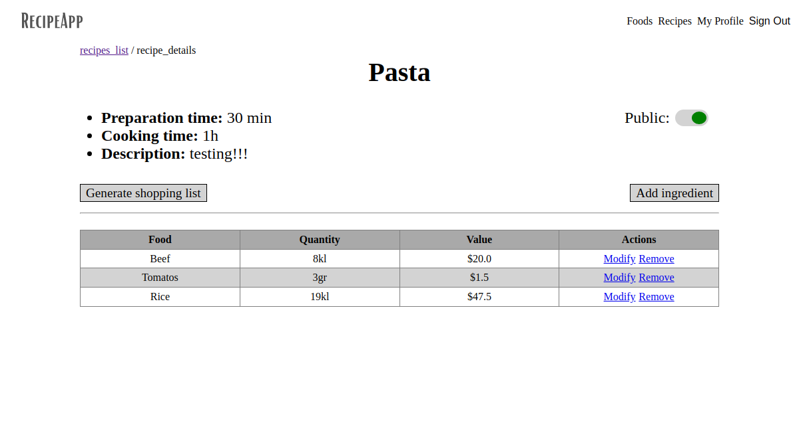

# Recipe App

> A recipe Rails app for creating recipes and generating shopping list with ingredients.



> Entity Relationship Diagram


The Recipe app keeps track of all your recipes and ingredients. The app will allow you to save ingredients, keep track of your items, create recipes, and generate a shopping list based on the ingredients from your recipes. Also, since sharing recipes is an important part of cooking the app allows you to make them public so anyone can access them.

## Built With

- Ruby
- Ruby on Rails
- PostgreSQL
- Devise


## Getting Started

To get a local copy up and running follow these simple steps.

### Prerequisites

- Have git correctly installed.
- Have Ruby correctly installed.
- Have Rails correctly installed.

### Setup

- Open a terminal window where you want to have installed a clone of the repository.

### Install

- Use this command to clone the repo:
```
$ git clone git@github.com:leopiresgoss/recipe-app.git
```
- Install the required dependencies:
```
$ bundle install
```
- Create database and load schema:
```
$ rails db:setup
```
### Usage

- Run:
```
$ rails s
```

- Tests:
```
$ rspec
```

- Edit the content as you like.


## Authors

👤 **Kenny Salazar**

- GitHub: [@helio3197](https://github.com/helio3197)
- Twitter: [@kennysalazar31](https://twitter.com/kennysalazar31)
- LinkedIn: [LinkedIn](https://linkedin.com/in/kenny-salazar-1a1687110)

👤 **Leonardo Pires Goss**
- GitHub: [leopiresgoss](https://github.com/leopiresgoss)
- Twitter: [@leonardopgoss](https://twitter.com/leonardopgoss)
- LinkedIn: [LinkedIn](https://www.linkedin.com/in/leonardogoss/)

## 🤝 Contributing

Contributions, issues, and feature requests are welcome!

Feel free to check the [issues page](../../issues/).

## Show your support

Give a ⭐️ if you like this project!

## Acknowledgments

- Thanks to Microverse for the guidelines.


## 📝 License

This project is [MIT](./LICENSE) licensed.
